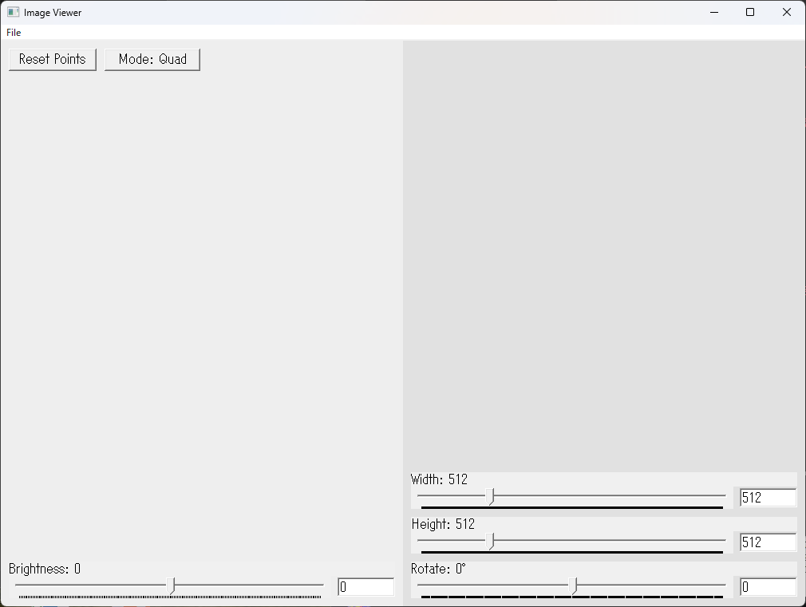
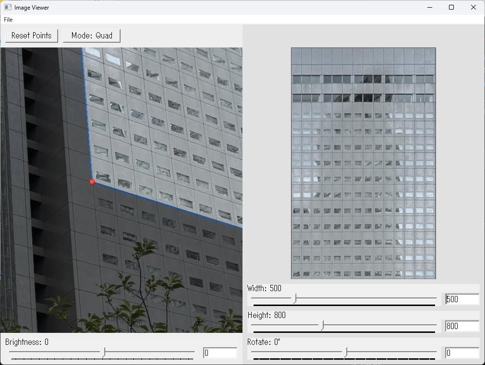
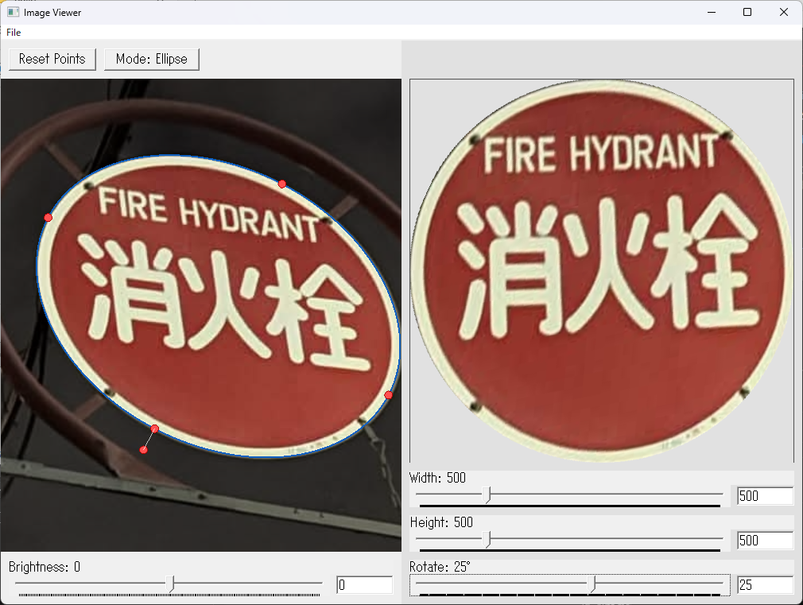

# imageProcessing

斜めから撮った紙や円形の対象を「正面から見た画像」に補正する，単一 EXE の Windows デスクトップアプリ．
画像を読み込み，Quad（4点）または Ellipse（楕円）で対象を囲むと，射影変換で正面化したプレビューがリアルタイムに表示され，PNG / JPEG として書き出せる．

- 言語/基盤: C++17 + Win32 API + GDI+（依存ライブラリゼロ・単一 EXE 配布）
- 画像補正: ホモグラフィ（射影変換）と逆写像バイリニア補間

> 💡 **すぐ試したい方へ**: [Releases](https://github.com/ikejun-10/ImageProcessing/releases/latest) から `ImageProcessing.exe` をダウンロードしてそのまま起動できます（インストール不要・追加ライブラリ不要）．



---

## 主な機能

- Import / Export: PNG / JPEG の読み込み・書き出し
- 2 つの選択モード
  - Quad（4点）: 画像上を 4 点で囲み，歪んだ四角形を正面の矩形へ補正
  - Ellipse（楕円）: 楕円を描画・移動・リサイズ・回転して，楕円内部を切り出し補正
- 左ペイン操作: ホイールでズーム（マウス位置中心）／中ボタンドラッグでパン
- 右ペイン: 補正結果のリアルタイムプレビュー（出力サイズ・回転を反映）
- 出力調整: 出力幅 / 高さ / 回転角をスライダーまたは数値入力（EditBox）で指定
- 明度補正（Brightness）: スライダーで明るさを調整

---

## 使い方

1. `bin\ImageProcessing.exe` を起動する
2. メニューの `File → Import Picture...` から PNG / JPEG を読み込む
3. 左ペインで対象を選択する
   - Quad モード: 対象の四隅を 4 点クリック（クリック順は自由 — 内部で正しい並びに自動整列）
   - Ellipse モード: モードを切り替え，楕円を描いてハンドルで移動・リサイズ・回転
4. 右ペインで正面化されたプレビューを確認する
   - 出力幅・高さ・回転角・明度を，スライダーまたは数値入力で微調整
5. `File → Export Corrected...` で PNG / JPEG として保存する
   - Quad モードの境界外は黒，Ellipse モードの境界外は透明（PNG で透過保存）

### Quad（4点）で加工

斜めから撮った四角形を 4 点で囲み，正面の矩形へ補正する．



### Ellipse（楕円）で加工

楕円を描いて内部を切り出し，回転・サイズを調整して補正する．



---

## ビルド

CMake + MSVC（Visual Studio 2022）を想定:

```powershell
cmake -S . -B build -G "Visual Studio 17 2022"
cmake --build build --config Release
```

成功すると `bin\ImageProcessing.exe` が生成される．

---

## 使用技術

| 領域 | 採用技術 |
|---|---|
| 言語 | C++17 |
| GUI | Win32 API 直叩き |
| 描画 | GDI+（PNG/JPEG 入出力・明度補正） |
| 補正アルゴリズム | 自前実装（ホモグラフィ／逆写像補間，OpenCV 不使用） |
| ビルド | CMake |

---

## 設計・実装の工夫

本アプリの主要なアルゴリズムと設計上の判断．

### 1. ホモグラフィ（射影変換）を 8 元連立方程式で解く

歪んだ四角形を正面の矩形へ写す変換は，3×3 のホモグラフィ行列 `H` で表せる（自由度 8，`h8 = 1` に固定）．

```
x = (h0·X + h1·Y + h2) / (h6·X + h7·Y + 1)
y = (h3·X + h4·Y + h5) / (h6·X + h7·Y + 1)
```

4 点対応からは点ごとに 2 本，計 8 本の線形方程式が立ち，これをガウス・ジョルダン法＋部分ピボット選択（数値的不安定を回避）で解く．

### 2. 4 点を決定的に正しく並べ替える

ユーザーのクリック順は自由だが，時計回りでないとホモグラフィが蝶ネクタイ型にねじれる．そこで順列全探索（4! = 24 通り）で，対辺が交差する並びを除外し，面積最大の並びを採用する．同じ頂点集合に対し一意・決定的である．

### 3. 逆写像バイリニア補間

順写像（入力→出力）は出力に穴・重なりが生じるため，逆写像（出力→入力）を採用．出力ピクセルごとに写った実数座標の最近傍 4 ピクセルを重み付き平均してなめらかに補正する．
ピクセル形式は `PixelFormat32bppPARGB`（アルファ事前乗算）を使用している．

### 4. 楕円のローカル座標系設計（Ellipse モード）

楕円を `(中心 cx, cy / 半径 a, b / 回転 θ)` で表現し，出力グリッドを楕円ローカル座標へ写してから回転 θ を考慮して画像座標へ変換する．

```
srcX = cx + lx·cosθ − ly·sinθ
srcY = cy + lx·sinθ + ly·cosθ
```

正規化座標で `nx² + ny² > 1` なら楕円外と判定して透明化 → PNG 保存時にきれいに透過する．

### 5. 明度補正は GDI+ の `ColorMatrix`

5×5 の `ColorMatrix`（アフィン変換）の最終行に `b` を入れ，RGB 全チャンネルにバイアスを加算するだけで明るさを調整する．

### 6. マウス位置中心のズーム

カーソル下の画像座標を固定したままパン量を補正し直すことで，見たい点がずれない直感的な拡大・縮小を実現している．

### 7. Win32 の作法

- EditBox サブクラス化: `SetWindowSubclass` で Enter を捕まえ，数値確定を親へ通知
- ダブルバッファリング: オフスクリーンの `Bitmap` に全描画してから 1 回転送し，チラつきを防止

---

## プロジェクト構成

```
src/
├── app/                      # アプリ入口（wWinMain / WndProc）
└── modules/
    ├── core/                 # 状態・幾何プリミティブ（線形方程式・ホモグラフィ・4点整列）
    ├── io/                   # Import / Export ダイアログと保存処理
    ├── view/                 # 表示geometry・座標変換・ヒットテスト・描画
    ├── controls/             # レイアウト・EditBox 反映・マウス/ホイール入力
    └── correction/           # 補正プレビューの生成（Quad / Ellipse）
```
